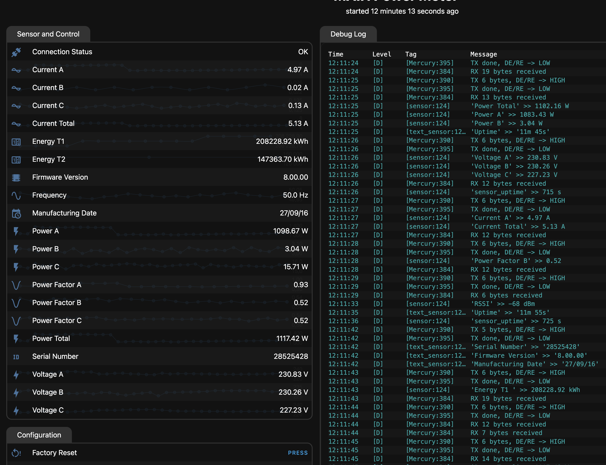

# ESPHome Mercury 230/236 Energy Meter Integration

Интеграция электросчётчиков Mercury 230/236 в ESPHome через RS485 интерфейс.



## Описание

Этот проект позволяет подключить электросчётчики семейства Mercury 230/236 к Home Assistant через ESPHome. Компонент поддерживает чтение всех основных параметров счётчика в реальном времени.

## Поддерживаемые модели 

- Mercury 230
- Mercury 236
- Другие модели семейства Mercury с RS485 интерфейсом

## Возможности

### Измеряемые параметры

- **Напряжение** по трём фазам (A, B, C)
- **Ток** по трём фазам и суммарный
- **Активная мощность** по трём фазам и суммарная
- **Коэффициент мощности** по трём фазам
- **Фазовые углы** между фазами
- **Частота сети**
- **Энергия** по тарифам (T1, T2, T3)
- **Энергия** по фазам (активная и реактивная)
- **Температура** внутри корпуса счётчика
- **Серийный номер** счётчика
- **Версия прошивки**
- **Дата изготовления**
- **Статус подключения**

## Требования

### Аппаратное обеспечение

- ESP32 или ESP8266 (рекомендуется ESP32)
- RS485 модуль (MAX485, MAX3485 или аналогичный)
- Электросчётчик Mercury 230/236 с интерфейсом RS485

### Подключение RS485


#### Для ESP32
```
RS485 Module → ESP32
RX  → GPIO1  (UART RX)
TX  → GPIO2  (UART TX)
```

#### Для ESP8266
```
RS485 Module → ESP8266
RX  → GPIO5  (D1)
TX  → GPIO4  (D2) 
```

**Важно:**  Подключай через автоматический rs485!!! без DE/RE

### Подключение к счётчику

Счётчик Mercury имеет клеммы RS485:
- **A** (или +) → RS485 A
- **B** (или -) → RS485 B

## Установка

### 1. Скопируйте компонент

Скопируйте папку `components/energy_meter_mercury230/` в директорию вашего ESPHome проекта.

### 2. Настройте конфигурацию

Пример минимальной конфигурации в файле `main-power-meter.yaml`.

## Конфигурация

### Пароли

Счётчики Mercury используют 6-байтовые пароли 111111 или 222222 по умолчанию.
Если пароль не указан, компонент автоматически попробует стандартные пароли.

### Адрес счётчика

Если адрес неизвестен, установите `use_address: 0` — компонент автоматически найдёт счётчик в сети. но не факт :)

## Отладка

Для диагностики проблем включите подробное логирование:

```yaml
logger:
  level: DEBUG
```

В логах вы увидите:
- `[=>]` — исходящие пакеты к счётчику
- `[<=]` — входящие пакеты от счётчика
- `TX ... bytes, DE/RE -> HIGH/LOW` — управление направлением RS485
- `RX ... bytes received` — получение данных
- `Response code: ...` — коды ответов счётчика

### Коды ошибок

| Код | Описание |
|-----|----------|
| 0 | OK - успешно |
| 1 | Недопустимая команда или параметр |
| 2 | Внутренняя ошибка счётчика |
| 3 | Недостаточный уровень доступа |
| 4 | Часы уже корректировались сегодня |
| 5 | Канал связи не открыт (неверный пароль) |
| 6 | Таймаут ответа |
| 7 | Переполнение буфера |

## Решение проблем

### Счётчик не отвечает

1. Проверьте подключение A/B проводов (не перепутаны ли)
2. Убедитесь, что RS485 модуль получает питание
3. Проверьте правильность адреса счётчика
4. Попробуйте отключить `active_led_pin` (для модулей с авто-управлением)

### Ошибка "Connection close" (код 5)

1. Проверьте пароль счётчика
2. Попробуйте формат HEX с `pass_in_hex: true`
3. Убедитесь, что используется правильный уровень доступа (`admin: true/false`)

### Данные не обновляются

1. Увеличьте `update_interval` до 30s
2. Проверьте логи на наличие ошибок таймаута
3. Убедитесь, что DE/RE управление работает корректно

## Совместимость

- **ESPHome**: 2024.x и выше (протестировано на 2026.3.2)
- **ESP-IDF**: поддерживается
- **Arduino**: поддерживается (ESP8266/ESP32)

## Структура проекта

```
components/energy_meter_mercury230/
├── __init__.py                    # Пустой файл пакета
├── sensor.py                      # Схема компонента ESPHome
├── energy_meter_mercury230.h      # Основной класс C++
└── mercury230_proto.h             # Протокол Mercury 230
```

## Благодарности

Основано на проекте [ESPHome-Mercury230](https://github.com/Brokly/ESPHome-Mercury230) by @Brokly и документации из интернета.

## Лицензия

Этот проект распространяется "как есть" без каких-либо гарантий.

## Поддержка

При возникновении проблем:
1. Включите DEBUG логирование
2. Проверьте физическое подключение
3. Убедитесь в правильности пароля и адреса
4. Изучите коды ошибок в логах
